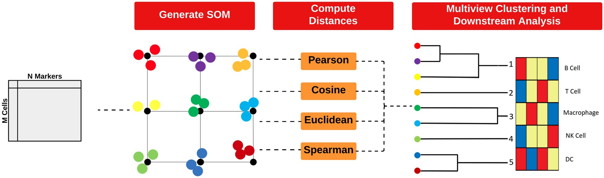
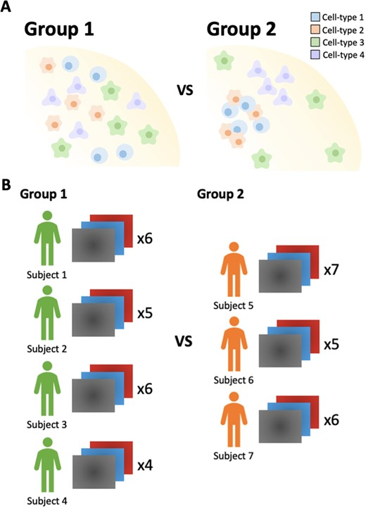
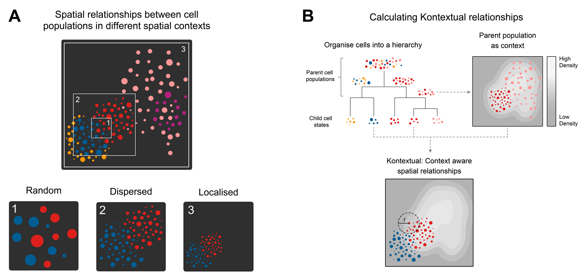
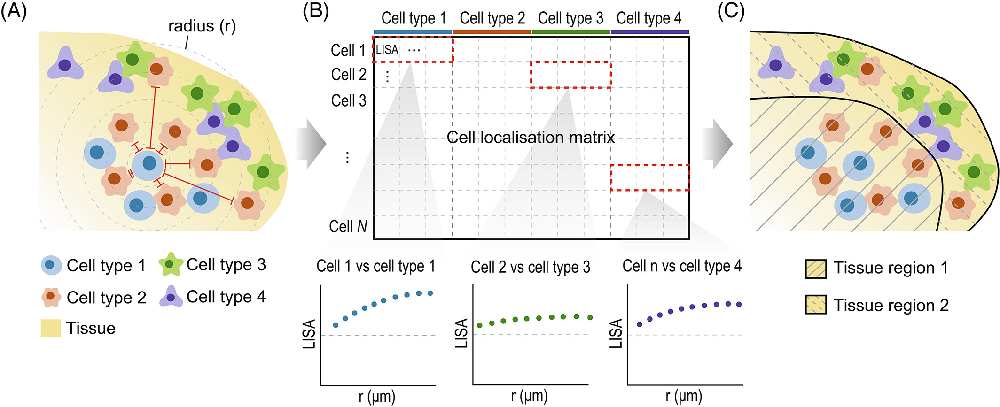
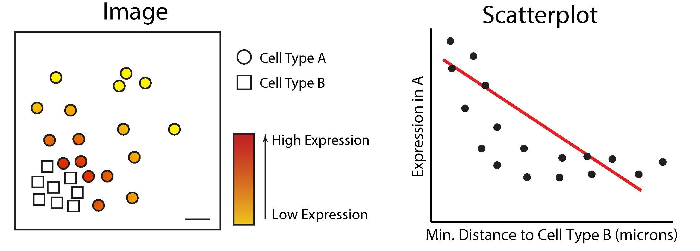

```{r setup, include=FALSE, message=FALSE}
knitr::opts_chunk$set(echo = TRUE, message = FALSE, warning = FALSE)
library(BiocStyle)
```

# Version Info

<p>

**R version**: `r R.version.string` <br /> **Bioconductor version**: `r BiocManager::version()` <br />

# Introduction

# Loading R packages

```{r load libraries, echo=FALSE, results="hide", warning=FALSE}
suppressPackageStartupMessages({
  library(tidyverse)
  library(cytomapper)
  library(dplyr)
  library(ggplot2)
  library(simpleSeg)
  library(FuseSOM)
  library(ggpubr)
  library(scater)
  library(spicyR)
  library(ClassifyR)
  library(lisaClust)
  library(tidySpatialExperiment)
  library(treekoR)
  library(Statial)
  library(scFeatures)
  library(lme4)
  library(knitr)
  library(gridExtra)
  library(imcRtools)
})
```

# Global paramaters

```{r}
# set parameters
set.seed(51773)

# set number of cores
nCores = 1
BPPARAM = BiocParallel::SerialParam()

# set ggplot theme
theme_set(theme_classic())
```

# Context

In this workshop, we will analyse some MIBI-TOF data [(Risom et al, 2022)](https://www.sciencedirect.com/science/article/pii/S0092867421014860?via%3Dihub#!) profiling the spatial landscape of ductal carcinoma in situ (DCIS), which is a pre-invasive lesion that is thought to be a precursor to invasive breast cancer (IBC). The key conclusion of this manuscript (amongst others) is that spatial information about cells can be used to predict disease progression in patients.

We’ll show that you can reach the same biological conclusion using different spatial analysis methods. Across all approaches, the data consistently points to the same insight: higher CD8 expression in T cells that are close to tumour cells is linked to tumour progression. By working with MIBI-TOF data from Risom et al. (2022), we’ll explore how different ways of measuring spatial context can still uncover meaningful and clinically relevant patterns in the tumour microenvironment.

# Load the clinical data

To link image features with disease progression, we need to import the clinical information that associates each image identifier with its corresponding progression status and patient metadata. We will do this here, making sure that the `imageID` values are correctly matched.

## Read the clinical data

```{r}
# read the clinical data CSV file 
clinical <- read.csv(
  system.file(
    "extdata/1-s2.0-S0092867421014860-mmc1.csv",
    package = "spicyWorkflow"
  )
)

# create a new 'imageID' column by concatenating relevant identifiers
clinical <- clinical |>
  mutate(imageID = paste0(
    "Point", PointNumber, "_pt", Patient_ID, "_", TMAD_Patient
  ))

# clinical variables of interest
clinicalVariables <- c(
  "imageID", "Patient_ID", "Status", "Age", "SUBTYPE", "PAM50", "Treatment",
  "DCIS_grade", "Necrosis"
)

# find rows where Tissue_Type is "normal" and append "_Normal" to their imageID
image_idx <- grep("normal", clinical$Tissue_Type)
clinical$imageID[image_idx] <- paste0(clinical$imageID[image_idx], "_Normal")

#clinical$Status <- factor(clinical$Status)
rownames(clinical) <- clinical$imageID
```

# Filter to Luminal B subtype

To keep the case study computationally efficient, we are going to only going to analyse patients with Luminal B breast cancer.

```{r}
# images associated with LumB subtype
lumBImages <- clinical |>
  filter(PAM50 == "LumB") |>
  pull(imageID)
```

# Read in images

The images are stored in the `images` folder in the form of single-channel TIFF images. In single-channel images, each pixel represents intensity values for a single marker. Here, we use the `loadImages` function from the `cytomapper` package to load all the TIFF images into a `CytoImageList` object and store the images as h5 file on-disk.

```{r}
pathToImages <- system.file("extdata/images", package = "spicyWorkflow")

# approx. runtime: 3 min
system.time({images <- cytomapper::loadImages(
  pathToImages,
  single_channel = TRUE, # one image per channel
  on_disk = TRUE, # on-disk loading to save RAM
  h5FilesPath = HDF5Array::getHDF5DumpDir(),
  BPPARAM = BPPARAM,
  as.is = TRUE
)})

# free unused memory
gc()

# filter images to LumB samples
images <- images[lumBImages]

# filter clinical data to LumB samples
clinical <- clinical |> filter(PAM50 == "LumB") 
```

## Put the clinical data into the `colData` of `CytoImageList`

We can then store the clinical information in the `mcols` slot of the `CytoImageList` object.

```{r add clinical data}
# Add the clinical data to mcols of images
mcols(images) <- clinical[names(images), clinicalVariables]
```

# Where are the cells in the images?

## Run simpleSeg

The typical first step in analysing spatial data is cell segmentation, which involves identifying and isolating individual cells in each image. This defines the basic units (cells) on which most downstream omics analysis is performed.

There are multiple approaches to cell segmentation. One approach involves segmenting the nuclei using intensity-based thresholding of a nuclear marker (such as DAPI or Histone H3), followed by watershedding to separate touching cells. The segmented nuclei are then expanded by a fixed or adaptive radius to approximate the full cell body.

The [simpleSeg](https://www.bioconductor.org/packages/release/bioc/html/simpleSeg.html) package on Bioconductor provides functionality for user friendly, watershed based segmentation on multiplexed cellular images based on the intensity of user-specified marker channels. The main function, `simpleSeg`, can be used to perform a simple cell segmentation process that traces out the nuclei using a specified channel.

```{r}
# Generate segmentation masks
# approx. runtime: 90 secs
masks <- simpleSeg(
  images,
  nucleus = c("HH3"), # trace out nuclei using the HH3 marker
  cellBody = "dilate", # use dilation strategy of segmentation
  transform = c("tissueMask","sqrt"), # remove background noise outside of sample area and perform sqrt transform
  sizeSelection = 20, # only cells > 20 pixels will be included
  discSize = 5, # dilate out from nucleus by 5 pixels
  cores = nCores
)
```

## Visualise separation

We can examine the performance of the cell segmentation using the `display` and `colorLabels` functions from the `EBImage` package.

```{r visualise segmentation}
# Visualise segmentation performance one way.
EBImage::display(colorLabels(masks[[1]]))
```

## Visualise outlines

To assess segmentation accuracy, we can overlay the nuclei masks onto the corresponding nuclear intensity channel with the `plotPixels` function from the `cytomapper` package. Ideally, the mask outlines (shown in white in the image below) should closely align with the boundaries of the nuclear signal (visualised in blue), indicating that the segmentation correctly captures the extent of each nucleus.

```{r}
# Visualise segmentation performance another way.
cytomapper::plotPixels(
  image = images[1],
  mask = masks[1],
  img_id = "imageID",
  colour_by = c("PanKRT", "HH3", "CD3", "CD20"),
  display = "single",
  colour = list(
    HH3 = c("black", "blue"),
    CD3 = c("black", "green"),
    CD20 = c("black", "red"),
    PanKRT = c("black", "yellow")
  ),
  bcg = list(
    HH3 = c(0, 1, 1.5),
    CD3 = c(0, 1, 3),
    CD20 = c(0, 1, 3),
    PanKRT = c(0, 1, 1.5)
  ),
  legend = NULL
)
```

In the image above, we can see that we've done relatively well at capturing the HH3 signal, but perhaps not such a good job at capturing the PanKRT signal, which largely lies outside our segmented outlines. To remedy this, we can increase `discSize` to capture more of the cell body; however, we need avoid capturing signal from neighbouring cells. Balancing the dilation size to capture the full cell body while minimising lateral spillover is therefore crucial.

# Summarise cell features

In order to characterise the phenotypes of each of the segmented cells, `measureObjects` from `cytomapper` will calculate the average intensity of each channel within each cell as well as a few morphological features. The channel intensities will be stored in the `counts assay` in a `SpatialExperiment`. Information on the spatial location of each cell is stored in `colData` in the `m.cx` and `m.cy` columns. In addition to this, it will propagate the information we have store in the `mcols` of our `CytoImageList` in the `colData` of the resulting `SpatialExperiment`.

```{r}
# Summarise the expression of each marker in each cell
# approx. runtime: 2 mins
cells <- cytomapper::measureObjects(
  masks,
  images,
  img_id = "imageID",
  return_as = "sce",
  feature_types = c("basic", "moment"),
  BPPARAM = BPPARAM
)

# Lets make our lives easy and add in x and y
cells$x = cells$m.cx
cells$y = cells$m.cy
cells
```

# How can we make marker quantification comparable across images?

Variability in marker intensity across images is a common challenge in spatial imaging, often driven by technical factors like staining efficiency, imaging conditions, or sample preparation. These inconsistencies can blur the distinction between marker-positive and -negative cells, leading to misclassification and unreliable comparisons between and within samples. Because raw intensities aren’t always directly comparable across or within images, quality control is an essential next step after segmentation.

Below, we extract marker intensities from the `counts` assay and take a closer look at the cytokeratin 7 (`CK7`) marker, which is often used as a diagnostic marker in breast cancer.

```{r, fig.width=5, fig.height=5}
# Extract marker data and bind with information about images
df <- as.data.frame(cbind(colData(cells), t(assay(cells, "counts"))))

# Plots densities of CK7 for each image.
ggplot(df, aes(x = CK7, colour = imageID)) +
  geom_density() +
  theme(legend.position = "none")
```

We can see that CK7 intensity is highly skewed, which makes it difficult to distinguish CK7+ cells from CK7- cells. Ideally, we would want to see a bimodal distribution of marker intensity, with one peak corresponding to CK7- cells and the other peak corresponding to CK7+ cells. This clear distinction between marker+ and marker- cells would also ensure that downstream clustering processes can easily distinguish between marker+ and marker- cells.

Additionally, we would also want to see that our marker+ or marker- cells are consistent across images, so that cells classified as CK7+ positive in one image are also classified as CK7+ in another image. If these peaks are not consistent, it might point to image-level batch effects.

To make marker intensity comparable across images, we can transform and normalise our data using the `normalizeCells` function from the `simpleSeg`. Here we have taken the intensities from the `counts` assay, performed an arcsine transform, then for each image trimmed the 99 quantile and min-max scaled to 0-1. This modified data is then stored in the `norm` assay by default. We can see that this normalised data appears more bimodal, not perfectly, but likely to a sufficient degree for clustering.

```{r, fig.width=5, fig.height=5}
# Transform and normalise the marker expression of each cell type.
# Use a  arc-sine transform, then trimmed the 99 quantile and then remove first principal component
cells <- normalizeCells(cells,
  transformation = "asinh",
  method = c("trim99", "minMax", "PC1"),
  assayIn = "counts",
  cores = nCores
)

# Extract normalised marker information.
norm_df <- as.data.frame(cbind(colData(cells), t(assay(cells, "norm"))))


# Plots densities of normalised CK7 for each image.
ggplot(norm_df, aes(x = CK7, colour = imageID)) +
  geom_density() +
  theme(legend.position = "none")
```

::: callout-tip
**Choosing transformation and normalisation methods**

Not all datasets require the same transformation or normalisation strategy. Choosing the right one can depend on both the biological context and the source of technical variability.

-   If our marker intensities show strong tails, applying a transformation (e.g., square root, log, or arcsinh) can help separate low vs high signal populations.

-   If we observe inconsistent peaks across images, we could use normalisation techniques such as centering on the mean, scaling by standard deviation, or regression-based adjustments (e.g., removing PC1, capping the highest 1% of values, etc.).
:::

# What types of cells are in my images?

Identifying what cell types are present in our images is a key step in many spatial analysis workflows, as it shapes how we analyse tissue composition, measure cell-cell interactions, and track disease mechanisms. One common approach is to apply unsupervised clustering methods followed by manual annotation of the resulting clusters.

## Use clustering

Clustering groups cells by similarity in their marker expression patterns, helping to identify distinct cell types or states. The choice of markers to use for clustering can greatly affect the populations we identify. Below, we've listed the markers used in the original study, and the cell types they can be used to identify.

```{r FuseSOM}
# The markers used in the original publication to gate cell types.
useMarkers <- c(
  # Epithelial/tumour markers
  "PanKRT",       # Pan-cytokeratin: general epithelial marker (tumour or normal epithelium)
  "ECAD",         # E-cadherin: adherens junctions, epithelial cell integrity; also seen in myoepithelium
  "CK7",          # Cytokeratin 7: luminal epithelial marker
  "VIM",          # Vimentin: mesenchymal marker; high in fibroblasts, EMT tumour cells, and endothelium

  # Stromal markers
  "FAP",          # Fibroblast activation protein: cancer-associated fibroblasts (CAFs)
  "CD31",         # PECAM1: endothelial cell marker (blood vessels)
  "CK5",          # Cytokeratin 5: basal epithelial and myoepithelial marker
  "SMA",          # Smooth muscle actin: myoepithelial cells and myofibroblasts

  # Immune lineage marker
  "CD45",         # Pan-leukocyte marker: expressed on all immune cells

  # T cells
  "CD4",          # Helper T cells: subset of CD3+ T cells
  "CD3",          # T cell receptor complex: all T cells
  "CD8",          # Cytotoxic T cells: subset of CD3+ T cells

  # B cells
  "CD20",         # B cell marker: mature B cells

  # Myeloid/antigen-presenting cells
  "CD68",         # Macrophage marker: especially tumour-associated macrophages
  "CD14",         # Monocyte marker: also on some dendritic cells
  "CD11c",        # Myeloid dendritic cells: also on monocyte-derived DCs and some macrophages
  "HLADRDPDQ",    # MHC class II: antigen presentation, expressed on DCs, macrophages, B cells

  # Granulocytes and mast cells
  "MPO",          # Myeloperoxidase: neutrophils and granulocytes
  "Tryptase"      # Mast cells: granule content marker, specific for mast cells
)

```

We can perform clustering with the `runFuseSOM` function from the [FuseSOM](https://www.bioconductor.org/packages/release/bioc/html/FuseSOM.html) package. `FuseSOM` is an unsupervised method that combines a **Self-Organising Map (SOM)** architecture with **MultiView integration** of correlation-based metrics, offering improved robustness and accuracy.



Here, we use the same subset of markers as the original manuscript for cell type gating, and set the number of clusters to `numClusters = 12`. Choosing the right number of clusters is important, as it can significantly influence the results: too few clusters may group distinct cell types together and mask biological differences, while too many clusters may artificially split a single cell population into multiple groups.

```{r}
# Set seed.
set.seed(51773)

# cells@metadata <- list() # This is sometimes needed to clear the clustering info.

# Generate SOM and cluster cells into 16 groups.
cells <- runFuseSOM(
  cells,
  markers = useMarkers,
  assay = "norm",
  numClusters = 12
)

```

## Check how many clusters should be used

We can assess the suitability of our choice of 12 clusters using the `estimateNumCluster` and `optiPlot` functions from the `FuseSOM` package. Here, we focus on the Gap statistic method, though other options like Silhouette and Within Cluster Distance are also available.

::: callout-tip
-   Generally, we're looking for the `k` (number of clusters) before the point of greatest inflection, or the point beyond which increasing `k` results in minimal improvement to clustering quality.

-   There can be several options of `k` if there are several points of inflection. The optimal choice depends on the expected number of cell types and the desired level of annotation resolution.
:::

As we can be seen below, we chose the second elbow point as the optimal number of clusters.

```{r}
cells <- estimateNumCluster(cells, kSeq = 2:30)
optiPlot(cells, method = "gap")
```

## Attempt to interpret the phenotype of each cluster

We can begin the process of understanding what each of these cell clusters are by using the `plotGroupedHeatmap` function from `scater`. At the least, here we can see we capture all the major immune populations that we expect to see.

```{r}
# Visualise marker expression in each cluster.
scater::plotGroupedHeatmap(
  cells,
  features = useMarkers,
  group = "clusters",
  exprs_values = "norm",
  center = TRUE,
  scale = TRUE,
  zlim = c(-3, 3),
  cluster_rows = FALSE
)
```

We can then annotate the clusters based on the canonical cell type markers they express.

```{r}
# annotate cell populations
cells <- cells |>
  mutate(cellType = factor(case_when(
      clusters == "cluster_1" ~ "Tumour",
      clusters == "cluster_2" ~ "Endothelial",
      clusters == "cluster_3" ~ "Myoepithelial",
      clusters == "cluster_4" ~ "Monocyte",
      clusters == "cluster_5" ~ "DC",
      clusters == "cluster_6" ~ "Macrophage",
      clusters == "cluster_7" ~ "T_cell_CD4",
      clusters == "cluster_8" ~ "T_cell_CD8",
      clusters == "cluster_9" ~ "Mast",
      clusters == "cluster_10" ~ "B_cell",
      clusters == "cluster_11" ~ "Other_immune",
      clusters == "cluster_12" ~ "Fibroblast",
      TRUE ~ clusters
  )))
  
```

## Check cluster frequencies

It’s always helpful to examine the number of cells in each cluster, as this provides insight into cluster relevance and stability. Here, we can see that

```{r}
# Check cluster frequencies.
colData(cells) |>
  as.data.frame() |>
  dplyr::count(cellType, sort = TRUE) |>
  knitr::kable()
```

## Plot cell types on an image

We can plot the cell types on an image to view their spatial distribution.

```{r}
reducedDim(cells, "spatialCoords") <- cbind(X = cells$m.cx, Y = cells$m.cy)

cells |> 
  filter(imageID == "Point2203_pt1072_31606") |>
  plotReducedDim("spatialCoords", colour_by = "cellType")

```

A heatmap of averages can be skewed by extreme values. We can always check the expression profile of the cell types with boxplots.

```{r}
cells |> 
  join_features(features = c("CD3"), assay = "norm", shape = "wide") |>
  ggplot(aes(x = cellType, y = CD3)) + geom_boxplot() +
  theme(axis.text.x = element_text(angle = 45, hjust = 1))
```

## Dimension reduction

As our data is stored in a `SingleCellExperiment` object, we can visualise our data in a lower dimension to see how well we can distinguish our annotated cell populations.

```{r}
set.seed(51773)
# Perform dimension reduction using UMAP.
# approx. runtime: 12 secs
cells <- scater::runUMAP(
  cells,
  subset_row = useMarkers,
  exprs_values = "norm"
)

# UMAP by cell type cluster.
scater::plotReducedDim(
  cells,
  dimred = "UMAP",
  colour_by = "cellType"
)
```

# Are there cell types that are more or less abundant with disease status?

A typical question of top priority would be to test whether certain cell types are more or less abundant across disease states. We recommend using a package such as `diffcyt` for testing for changes in abundance of cell types. However, the `colTest` function from the `spicyR` package allows us to quickly test for associations between the proportions of cell types and progression status using either Wilcoxon rank sum tests or t-tests.

```{r}
# Perform simple wicoxon rank sum tests on the columns of the proportion matrix.
testProp <- colTest(cells,
  condition = "Status",
  feature = "cellType"
)

testProp
```

We can see that immune cells generally tend to be more abundant in progressors compared to non-progressors. CD8 T cells and monocytes in particular tend to be more abundant in progressors compared to non-progressors. We can visualise the difference in abundance for CD8 T cells with a boxplot.

```{r}
# Calculate cell type proportions for all cell types
prop <- getProp(cells, feature = "cellType")

# Visualise the distribution of CD8 T cells
boxplot(
  prop[, "T_cell_CD8"] ~ clinical[rownames(prop), "Status"],
  main = paste("Proportion of T_cell_CD8 by Clinical Status"),
  xlab = "Clinical Status",
  ylab = "Cell Type Proportion",
)

```

Progressors have a higher proportion of CD8 T cells compared to non-progressors.

# Do spatial relationships between cell types change?

Spatial co-localisation analysis helps uncover whether specific cell types are found near each other more (or less) often than expected by chance. This can reveal insights into immune infiltration, tumour-stroma interactions, or the organisation of functional niches.

Before drawing conclusions from co-localisation patterns, it’s important to recognise the potential confounding factors that can distort results. Tissue architecture is rarely random as cells are often organised into structured regions, influenced by development, disease states, or sampling. If this spatial inhomogeneity isn’t accounted for, standard co-localisation methods can misinterpret natural density variations as meaningful interactions. Similarly, differences in cell abundance across images, due to either biology or technical variability, can affect the stability of association metrics. And finally, variation between samples or replicates must be considered to ensure that observed patterns are consistent and not driven by a few outliers. Any robust co-localisation analysis must address all three of these challenges: local spatial structure, uneven cell-type frequencies, and replicate-level variability.

The [spicyR](https://www.bioconductor.org/packages/release/bioc/html/spicyR.html) package provides functionality to quantify the degree of localisation or dispersion between two cell types. This localisation metric quantifies whether two cell types in an image tend to be closer together (co-localised) or further apart (dispersed) than would be expected by chance. A positive value indicates that two cell types are co-localised, while a negative value suggests they are dispersed. A value close to zero indicates that the cells are randomly distributed. spicyR can then test for changes in this co-localisation metric across different disease states or groups.



## CD8 T cells are more localised with tumour cells in progressors

We can use the `spicy` function from the `spicyR` package to evaluate all pairwise relationships between cell types. To draw meaningful conclusions from co-localisation patterns, it’s important to carefully choose the proximity radius `r` which is the distance that defines when two cells are considered “near” each other. This radius should reflect the biological scale of interaction, such as the typical signaling range or physical cell contact. If the radius is too small, real associations might be missed due to slight spatial variability or measurement noise. On the other hand, if the radius is too large, the analysis may pick up false signals driven by overall regional cell density rather than genuine biological interactions.

```{r}
# Test for changes in pair-wise spatial relationships between cell types.
spicyTest <- spicy(
  cells,
  condition = "Status", # the clinical outcome of interest
  cellType = "cellType",
  imageID = "imageID",
  spatialCoords = c("x", "y"),
  r = 50, # evaluate spatial relationships at 50 pixels
  sigma = 20, # account for tissue inhomogeneity
  cores = nCores
)

topPairs(spicyTest, n = 10)
```

One of our most significant cell type interactions is `Tumour__T_cell_CD8` with a positive coefficient, which suggests that there is increased localisation between CD8 T cells and tumour cells in progressors vs non-progressors.

::: {.callout-tip title="Choosing parameters for spicy"}
**How do we select an optimal value for `r`?**

-   The choice of `r` will depend on the degree of co-localistion we expect to see and the biological context. Choosing a small value of `r` is optimal for examining local spatial relationships, and larger values of `r` will reveal global spatial relationships.

-   When the degree of localistion is unknown, it is best to choose a range of radii to define the co-localisation statistic to capture both local and global relationships.
:::

We can visualise these tests using `signifPlot`, where we observe that cell type pairs appear to become less attractive (or avoid more) in progression samples.

```{r}
# Visualise which relationships are changing the most.
signifPlot(
  spicyTest,
  breaks = c(-1.5, 3, 0.5)
)
```

We can use the `spicyBoxPlot` function to visualise the relationship between a pair of cell types in more detail.

```{r}
spicyBoxPlot(spicyTest,
             from = "T_cell_CD8",
             to = "Tumour")
```

In the plot above, we can see that CD8 T cells are more localised with tumour cells in progressors compared to non-progressors.

We can use the `plotImage` function to visualise the spatial relationship between two cell types in a single image. First, we will combine our calculated L-function with the `Status` of the sample.

```{r}
data.frame(imageID = spicyTest$imageIDs, 
           L_func = spicyTest$pairwiseAssoc$T_cell_CD8__Tumour,
           condition = spicyTest$condition)
```

Then, we can use `plotImage` and specify the image ID to plot. Below, we've plotted `Point6102_pt1019_20648`, a progression sample, where we can see CD8 T cells infiltrating tumours.

```{r}
plotImage(cells,
          imageToPlot = "Point6102_pt1019_20648",
          from = "T_cell_CD8",
          spatialCoords = c("x", "y"),
          to = "Tumour")
```

In contrast, when we plot a non-progression sample (`Point2203_pt1072_31606`), we can see that CD8 T cells show minimal infiltration into the tumours compared to the progression samples.

```{r}
plotImage(cells,
          imageToPlot = "Point2203_pt1072_31606",
          from = "T_cell_CD8",
          spatialCoords = c("x", "y"),
          to = "Tumour")
```

## Using spicyR with custom metrics

`spicyR` can also be applied to custom distance or abundance metrics. A kNN interactions graph can be generated with the function `buildSpatialGraph` from the `imcRtools` package. This generates a `colPairs` object inside of the `SingleCellExperiment` object.

`spicyR` provides the function `convPairs` for converting a `colPairs` object into an abundance matrix by calculating the average number of nearby cells types for every cell type for a given `k`. For example, if there exists on average 3 tumour cells for every CD8 T cell in an image, the column `T_cell_CD8__Tumour` would have a value of 3 for that image.

```{r}
# build kNN graph
cells <- imcRtools::buildSpatialGraph(cells, 
                                      img_id = "imageID", 
                                      type = "knn", 
                                      k = 20, 
                                      coords = c("x", "y"))

# convert colPairs object into an abundance matrix
pairAbundances <- convPairs(cells,
                  colPair = "knn_interaction_graph")

head(pairAbundances["T_cell_CD8__Tumour"])
```

The custom distance or abundance metrics can then be included in the analysis with the `alternateResult` parameter.

```{r}
spicyTestkNN <- spicy(
  cells,
  condition = "Status",
  alternateResult = pairAbundances,
  weights = FALSE,
  BPPARAM = BPPARAM
)

topPairs(spicyTestkNN)
```

```{r}
# Visualise which relationships are changing the most.
signifPlot(
  spicyTestkNN,
  breaks = c(-1.5, 3, 0.5)
)
```

Similar to the L-function metric, the kNN graph reveals CD8 T cells and tumour cells tend to be more localised in progression samples compared to non-progression samples.

```{r}
spicyBoxPlot(spicyTestkNN,
             from = "T_cell_CD8",
             to = "Tumour")
```

# Are tumour cells closer to CD8 T cells than other T cells in progressors?

When assessing whether tumour cells are closer to CD8 T cells than to other T cells in progressors, it's important to maintain context by comparing these distances relative to other immune cell populations. Using other T cells or immune cells as the reference context helps account for differences in local immune density and ensures that observed proximity reflects specific spatial preferences rather than general immune infiltration. The `Kontextual` function from the [Statial](https://www.bioconductor.org/packages/release/bioc/html/Statial.html) package provides a context-aware spatial co-localisation metric.



To use `Kontextual`, we first define a cell type hierarchy.

```{r}
# define cell type hierarchy
biologicalHierarchy <- list(
  T_cell = c("T_cell_CD8", "T_cell_CD4"), 
  Immune = c("B_cell", "T_cell_CD8", "T_cell_CD4", "Other_immune", "Mast", "Macrophage", "Monocyte", "DC")
  )
```

Then, we can create a dataframe containing all pairwise combinations using the `parentCombinations` function.

```{r}
parentDf <- parentCombinations(
  all = as.character(unique(cells$cellType)),
  parentList = biologicalHierarchy
)

head(parentDf)
```

We can then use the `Kontextual` function to evaluate co-localisation between pairs of cell types with respect to a parent population. In this case, we are calculating the `Kontextual` metric over a radius of 100.

```{r}
kontextualResult <- Kontextual(
  cells = cells,
  parentDf = parentDf,
  r = 100,
  cellType = "cellType",
  spatialCoords = c("x","y"),
  cores = nCores
)

head(kontextualResult)
```

For every pairwise relationship (named accordingly: `from__to__parent`) `Kontextual` outputs the L-function values (original) and the `Kontextual` value. The relationships where the L-function and `Kontextual` disagree (e.g. one metric is positive and the other is negative) represent relationships where adding context information results in different conclusions on the spatial relationship between the two cell types.

```{r}
# convert from dataframe to wide matrix 
kontextMat <- prepMatrix(kontextualResult)

# use spicyR to check for differences in Kontextual metric across disease state
spicyKontextual <- spicy(cells,
                         condition = "Status",
                         imageID = "imageID", 
                         cellType = "cellType",
                         alternateResult = kontextMat,
                         cores = nCores)

topPairs(spicyKontextual)
```

One of the results that pops up is `Tumour__T_cell_CD8__Immune`, which is the relationship between tumour cells and CD8 T cells relative to the parent population of all immune cells. We can see that CD8 T cells are comparatively more localised with tumour cells from the positive coefficient.

```{r fig.height=6, fig.width=7}
# Visualise which relationships are changing the most.
signifPlot(
  spicyKontextual
)
```

At a glance, we can see that CD8 T cells are more localised with tumour cells relative to both other immune cells and T cells.

# Are there any broad spatial domains associated with progression?

Beyond pairwise spatial relationships between cell types, imaging datasets reveal richer layers of tissue organisation through concepts like niches, neighborhoods, microenvironments, and spatial domains. Niches typically describe the immediate surroundings of a specific cell, while spatial domains represent larger tissue compartments formed by coordinated cell arrangements.

The interpretation of spatial domains is highly context-dependent. In cancer research, domain analysis might highlight the distribution of tumor and immune compartments or reveal how domain composition correlates with disease progression. We will first attempt to identify larger spatial domains and determine whether the composition of these domains varies with progression status.

The [lisaClust](https://www.bioconductor.org/packages/release/bioc/html/lisaClust.html) package can be used to calculate the L-function metric over a range of radii, called Local Indicators of Spatial Association, or LISA curves. We can then perform k-means clustering on these LISA curves to obtain spatial domains.



Below, we've specified `k = 2` to identify two broad domains.

```{r}
set.seed(51773)

# Cluster cells into spatial regions with similar composition.
cells <- lisaClust(
  cells,
  k = 2,
  Rs = c(50, 100), 
  sigma = 20,
  spatialCoords = c("x", "y"),
  cellType = "cellType",
  regionName = "domain",
  cores = nCores
)
```

These domains are stored within `colData` and can be extracted.

## Region - cell type enrichment heatmap

We can try to interpret which spatial orderings the regions are quantifying using the `regionMap` function. This plots the frequency of each cell type in a region relative to what you would expect by chance.

```{r, fig.height=5, fig.width=5}
# Visualise the enrichment of each cell type in each region
regionMap(cells, cellType = "cellType", region = "domain", 
          limit = c(0.2, 5)) + 
  theme(axis.text.x = element_text(angle = 90, vjust = 0.5, hjust = 1))
```

Above, we can see that most immune cells are concentrated in `region_1`. We can further segregate these cells by increasing the number of clusters (domains) if needed.

The choice of `k` depends largely on the biological question being asked. For instance, if we are interested in understanding the interactions between immune cells in a tumor microenvironment, the number of clusters should reflect the known biological subtypes of immune cells, such as T cells, B cells, macrophages, etc. In this case, a larger value of `k` may be needed to capture the diversity within these immune cell populations.

On the other hand, if the focus is on interactions between immune cells and tumor cells, we might choose a smaller value of `k` to group immune cells into broader categories like we have done here.

Additionally, methods like the Gap statistic, Jump statistic, or Silhouette score could be employed to determine an optimal value of `k`.

## Visualise regions

We can quickly examine the spatial arrangement of the spatial domains using `ggplot`.

```{r}
# Extract cell information and filter to specific image.
colData(cells) |>
as.data.frame() |>
filter(imageID == "Point6102_pt1019_20648") |>
# Colour cells by their region.
ggplot(aes(x = m.cx, y = m.cy, colour = domain)) +
  geom_point()
```

While much slower, we have also implemented a function for overlaying the region information as a hatching pattern so that the information can be viewed simultaneously with the cell type calls.

```{r eval = FALSE}
# Use hatching to visualise regions and cell types.
hatchingPlot(
  cells,
  useImages = "Point6102_pt1019_20648",
  cellType = "cellType",
  region = "domain",
  spatialCoords = c("x", "y"),
  window = "square",
  nbp = 100
)
```

In the plot above, we can see that `region_2` captures our tumour regions, while `region_1` captures the non-tumour regions.

## Test for association with progression

If needed, we can again quickly use the `colTest` function to test for associations between the proportions of the cells in each domain and progression status using either Wilcoxon rank sum tests or t-tests.

```{r}
# Test if the proportion of each region is associated
# with progression status.
testRegion <- colTest(
  cells,
  feature = "domain",
  condition = "Status"
)

testRegion
```

# Are there any cell type associations with progression that are specific to each domain?

Similarly, we can then check whether the composition of each domain is significantly associated with tumour progression. To do this, we can use `colTest` to perform Wilcoxon rank-sum tests within each domain For every domain, we test whether there is a significant difference in cell type proportions between non-progressors and progressors.

```{r warning = F, message = F}
# Test for region 1 (non-tumour domain)
cells |>
  filter(domain == "region_1") |>
  colTest(feature = "cellType", condition = "Status", type = "wilcox")
```

```{r warning = F, message = F}
# Test for region 2 (tumour domain)
cells |>
  filter(domain == "region_2") |>
  colTest(feature = "cellType", condition = "Status", type = "wilcox")
```

Above, we can see that CD8 T cells are differentially abundant in progressors vs non-progressors within tumour domains.

## Visualise differences {.tabset}

### Boxplot

We can quickly generate a boxplot to visualise the differences in the abundance of CD8 T cells within the tumour domain.

```{r}
# Obtain cell type proportions within domain 2
df <- cells |> 
  filter(domain == "region_2") |>
  getProp(feature = "cellType")

df$imageID <- rownames(df)

# extract imageID and tumour progressio status from colData
cData <- colData(cells) |> as.data.frame() |> distinct(Status, imageID)

# Merge data and visualise
df <- inner_join(df, cData, by = "imageID")

ggplot(df, aes(x = Status, y = T_cell_CD8, colour = Status)) +
  geom_boxplot() +
  theme(legend.position = "none")
```

We can see from the boxplot that within the tumour domain, CD8 T cells are more abundant in progressors compared to non-progressors.

### Extension: Mixed effects model: interaction between domain and tumour progression status

We can check if there is an interaction effect between domain and status with mixed effects models. That is, we could test to see if there are more CD8 T cells in region 2 for progressors than region 1 for progressors. Below, we build one mixed effects model for every cell type with a domain/status interaction effect and include `imageID` as a random effect.

```{r warning = F, message = F}
# Initialize a vector to store p-values from the interaction test
pval <- c()

propD1 <- getProp(cells[,cells$domain=="region_1"])
propD2 <- getProp(cells[,cells$domain=="region_2"])

# Loop through each unique cell type and test for Domain × Status interaction
for (ct in unique(cells$cellType)) {

  # Construct a data frame of proportions for Domain 1 and Domain 2
  df <- data.frame(
    D1 = propD1[rownames(prop), ct],
    D2 = propD2[rownames(prop), ct],
    Status = as.character(clinical[rownames(prop), "Status"]),
    imageID = rownames(prop)
  )

  # Pivot data to long format for modeling
  df_long <- pivot_longer(
    df,
    cols = c("D1", "D2"),
    names_to = "Domain",
    values_to = "Proportion"
  )

  # Fit full model with Domain × Status interaction
  model_full <- lmer(sqrt(Proportion) ~ Domain * Status + (1 | imageID), data = df_long)

  # Fit additive model (no interaction)
  model_add <- lmer(sqrt(Proportion) ~ Domain + Status + (1 | imageID), data = df_long)

  # Perform likelihood ratio test to assess significance of the interaction term
  an <- anova(model_full, model_add)

  # Store p-value for the interaction term
  pval[ct] <- an$`Pr(>Chisq)`[2]
}

# Display sorted p-values to find cell types with strongest Domain × Status effects
sort(pval)
```

We can visualise cell type proportions for one cell type of interest `T_cell_CD8` to examine how abundance changes within different domains for progressors vs non-progressors.

```{r}
ct <- "T_cell_CD8"  # Cell type of interest for visualization

# Create a data frame with domain-specific proportions and metadata
df <- data.frame(
  D1 = propD1[rownames(prop), ct],  # Proportion of the cell type in domain D1
  D2 = propD2[rownames(prop), ct],  # Proportion of the cell type in domain D2
  Status = as.character(clinical[rownames(prop), "Status"]),  # Clinical status of each image
  imageID = rownames(prop)  # Unique image identifier
)

# Reshape data to long format for modeling and plotting
df_long <- pivot_longer(
  df,
  cols = c("D1", "D2"),  # Columns representing domain-specific proportions
  names_to = "Domain",   # New column indicating the domain (D1 or D2)
  values_to = "Proportion"  # Corresponding cell type proportion
)

# Fit a linear mixed-effects model with interaction between Domain and Status
# Include random intercept for each image to account for repeated measures
model <- lmer(sqrt(Proportion) ~ Domain * Status + (1 | imageID), data = df_long)

# Create a data frame of combinations for prediction (fixed effects only)
new_data <- expand.grid(
  Domain = unique(df_long$Domain),
  Status = unique(df_long$Status)
)
new_data$Predicted <- predict(model, newdata = new_data, re.form = NA)

# Plot observed data with boxplots, coloured by status
# Transform proportions using square root for better distribution
ggplot(df_long, aes(x = Domain, y = sqrt(Proportion), colour = Status)) +
  geom_boxplot()

```

From the graph, we can see that the proportion of CD8 T cells in the tumour domain (`D2`) is higher in progressors vs non-progressors. This is a substantial increase compared to the proportion of CD8 T cells in the non-tumour domain (`D1`) in progressors vs non-progressors.

# Are there any cell type niches associated with progression?

Another approach is to identify niches, which are defined by the immediate surroundings of a cell, usually within a small k-hop. We can once again use the `lisaClust` function, this time defining `k = 50` to identify a large number of niches.

```{r}
set.seed(51773)

# Cluster cells into spatial regions with similar composition.
cells <- lisaClust(
  cells,
  k = 20, # identify 50 niches
  r = 50,
  spatialCoords = c("x", "y"),
  cellType = "cellType",
  regionName = "niche",
  cores = nCores
)
```

```{r}
# Test if the proportion of each region is associated
# with progression status.
testNiche <- colTest(
  cells,
  feature = "niche",
  condition = "Status",
  type = "wilcox")

testNiche
```

One of the most significant niches we identify is `region_9`. We can examine the composition of niche 9 in more detail below.

```{r}
# sort by cell type frequency for niche 9
colData(cells) |>
  as.data.frame() |>
  filter(niche == "region_9") |>
  dplyr::count(cellType, sort = TRUE) |>
  knitr::kable()
```

We can also use the `regionMap` function to visualise the relative frequency of each cell type in each niche. This also shows us that `region_9` is enriched for CD8 T cells in particular.

```{r}
# Visualise the enrichment of each cell type in each region
regionMap(cells, cellType = "cellType", region = "niche", 
          limit = c(0.2, 10)) + 
  theme(axis.text.x = element_text(angle = 90, vjust = 0.5, hjust = 1))
```

We can confirm this with a Chi-squared test and check whether certain cell types are highly enriched in certain niches. We can use the residuals from the Chi-squared test to identify which cell types are highly enriched in `region_9`.

```{r}
# Extract the standardized residuals from the test result
residuals_tab <- 
  chisq.test(table(cells$cellType, cells$niche))$res

# Define the top 10 cell types to examine from our previous Wilcox test results
# These are the top 10 niches whose proportion is associated with progression status
top_niches <- rownames(testNiche)[1:10]

# View standardized residuals for "T_cell_CD8" across the top 10 cell types (likely a typo: should be top niches?)
residuals_tab["T_cell_CD8", top_niches]
```

## Proximity related changes in marker expression

***What if we hadn't clustered down to CD8 T cells?***

Often we are not able to cluster cell types to a very fine resolution. What if we had not separated CD8+ T cells and CD4+ T cells into two clusters? We will next explore two different ways that we could have seen higher CD8 expression in Tcells as they get closer to Tumour cells in progressors. To do this, we first combine our CD8 and CD4 T cell populations.

```{r}
cells <- cells |>
  mutate(cellTypeMergeTcells = factor(case_when(
      cellType == "T_cell_CD8" ~ "T_cell",
      cellType == "T_cell_CD4" ~ "T_cell",
      TRUE ~ cellType
  )))
  
```

The `SpatioMark` function in the Statial package quantifiers markers whose expression levels change within a given cell type depending on their spatial context. This allows us to detect context-dependent expression shifts—revealing, for instance, how the presence of neighbouring immune or tumour cells can influence a cell’s functional state.



The first step in analysing these changes is to calculate the spatial proximity and abundance of each cell to every cell type. `getDistances` calculates the Euclidean distance from each cell to the nearest cell of each cell type. `getAbundances` calculates the K-function value for each cell with respect to each cell type. Both metrics are stored in the `reducedDims` slot of the `SingleCellExperiment` object.

```{r}
# calculate Euclidean distance from each cell to the nearest cell of each cell type
cells <- getDistances(cells,
  cellType = "cellTypeMergeTcells",
  spatialCoords = c("x", "y"),
  redDimName = "distancesTcells"
)

# calculate K-function value for each cell with respect to a cell type
cells <- getAbundances(cells,
  r = 50,
  cellType = "cellTypeMergeTcells",
  spatialCoords = c("x", "y"),
  redDimName = "abundancesTcells",
)

reducedDimNames(cells)
```

```{r}
reducedDim(cells, "distancesTcells") |> head()
```

```{r}
reducedDim(cells, "abundancesTcells") |> head()
```

We can then use the `calcStateChanges` function to examine whether the expression of different markers changes with proximity to a cell type (`distancesTcells`).

```{r}
stateChangesTcells <- calcStateChanges(
  cells,
  assay = "norm",
  cellType = "cellTypeMergeTcells", # specify the column containing merged T cell types
  type = "distancesTcells", # define the metric of interest
  minCells = 5 # minimum number of cells required to fit a model
)

head(stateChangesTcells)
```

The output is a dataframe, where each row corresponds to the relationship between a primary and secondary cell type for a specific marker in a specific image.

```{r}
# convert stateChangesTcells to a matrix for further analysis
stateMatTcells <- prepMatrix(stateChangesTcells, replaceVal = NA, column = "coef")

# replace all infinity values with NA
stateMatTcells[stateMatTcells == Inf] <- NA
stateMatTcells[1:5, 1:5]
```

The output of this conversion is a dataframe where each column contains the coefficients associated with a specific marker-cell type pair relationship. For instance, in the column `Tumour__DC__PDL1` the first coefficient is `8.62e-05`, which indicates that as tumour cells get closer to dendritic cells `DC` they express higher levels of the marker PDL1 in the image `Point3105_pt1173_31661`.

We can then check whether this metric is significantly associated with progression status using `colTest`.

```{r}
# drop all columns where more than 40% values are NA (issues with model fit)
stateMatTcells <- stateMatTcells[,colMeans(is.na(stateMatTcells[rownames(prop),]))<0.4]

# t-test to check for changes across progression status
stateResultsTcells <- colTest(stateMatTcells[rownames(prop), ], 
                              droplevels(clinical[rownames(prop), "Status"]))
head(stateResultsTcells)
```

```{r}
# Search for our relationship of interest: CD8 expression in T cells with proximity to Tumour cells
stateResultsTcells[grep("T_cell__Tumour__CD8", stateResultsTcells$cluster),]
```

```{r}
# Extract the feature of interest for matched samples
feature_values <- stateMatTcells[rownames(prop), "T_cell__Tumour__CD8"]

# Get the clinical status for the same samples
status <- clinical[rownames(prop), "Status"]

# Create a boxplot of the feature stratified by clinical status
boxplot(feature_values ~ status,
        main = "CD8 T cell - Tumour Interactions by Clinical Status",
        ylab = "Interaction Score",
        xlab = "Status")

# Add a horizontal reference line at 0
abline(h = 0, lty = 2, col = "gray40")
```

From the boxplot above, we can see that the coefficient is positive for non-progressors, indicating that CD8 expression in T cells increases as distance from Tumour cells increases. On the other hand, the coefficient for progressors is negative, indicating that CD8 expression in T cells increases as the distance to tumour cells decreases.

The `plotStateChanges` function can be used to visualise this relationship in the original images. Below, we can see that CD8 expression increases in T cells that are closer to the tumour.

```{r}
p <- plotStateChanges(
  cells = cells,
  type = "distancesTcells",
  image = "Point2312_pt1064_20700",
  from = "T_cell",
  to = "Tumour",
  marker = "CD8",
  spatialCoords = c("m.cx", "m.cy"),
  assay = "norm",
  cellType = "cellTypeMergeTcells",
  size = 1,
  shape = 19,
  interactive = FALSE,
  plotModelFit = TRUE,
  method = "lm")

# p
p$image
```

# Marker expression across cell types in each domain

We can add another layer of information by looking at average marker expression within cell types in each domain. The `getMarkerMeans` function from the `Statial` package can be used to obtain the average expression of each marker within each cell type and domain.

```{r}
genesCellDomains <- getMarkerMeans(cells,
                                   imageID = "imageID",
                                   cellType = "cellTypeMergeTcells",
                                   region = "domain",
                                   assay = "norm")

head(genesCellDomains)
```

We can then perform t-tests on our columns of interest, which would be `CD8__T_cell__region_2`, i.e., expression of CD8 in T cells in the tumour domain. First, we'll incorporate tumour progression status into the dataset above.

```{r}
genesCellDomains$imageID <- rownames(genesCellDomains)
status <- colData(cells) |> as.data.frame() |> distinct(imageID, Status)
genesCellDomains <- inner_join(genesCellDomains, status, by = "imageID")

t.test(`CD8__T_cell__region_2` ~ Status, data = genesCellDomains)
```

For comparison, we can repeat the test above for the non-tumour domain.

```{r}
t.test(`CD8__T_cell__region_1` ~ Status, data = genesCellDomains)
```

```{r}
# pivot to long format
genes_long <- genesCellDomains |>
  pivot_longer(
    cols = -c(imageID, Status),
    names_to = "feature",
    values_to = "expression"
  )

# Split feature into marker, cell type, domain
genes_long <- genes_long |>
  separate(feature, into = c("marker", "celltype", "domain"), sep = "__")

# Filter to just CD8 and T_cell
genes_plot <- genes_long |>
  filter(marker == "CD8", celltype == "T_cell")

# Plot everything in one plot, colored by domain
ggplot(genes_plot, aes(x = domain, y = expression, colour = Status)) +
  geom_boxplot(position = position_dodge(width = 0.8)) +
  labs(y = "Average CD8 expression", title = "CD8 in T cells across domains")

```

# Can we use these spatial metrics to predict patient outcomes?

Classification models play a central role in spatial omics by identifying features that distinguish between patient groups—advancing both mechanistic understanding and clinical stratification. These distinguishing features can capture a wide range of biological signals, from differences in tissue architecture and cell-cell interactions to variations in cell state or microenvironment composition. Depending on the aim, analyses may seek to explain the underlying biology of a condition or to build predictive models for clinical outcomes such as progression, metastasis, or therapeutic response.

However, due to biological heterogeneity, not all features are informative across all individuals. To address this, robust modelling frameworks must accommodate complex, subgroup-specific signals. This ensures that models not only perform well statistically but also yield biologically and clinically meaningful insights. [ClassifyR](https://www.bioconductor.org/packages/release/bioc/html/ClassifyR.html) provides such a framework, offering tools for feature selection, repeated cross-validation, performance evaluation, survival analysis, and integration across multiple data types. It is designed to rigorously assess which features predict outcomes, and for which subgroups, thereby enhancing both discovery and translational potential.

We will first create a list to store three metrics: cell type proportions, pairwise cell type co-localisation (`spicyR`), and proportions of cells within each domain (`lisaClust`).

```{r message=FALSE, warning=FALSE}
# Create list to store data.frames
data <- list()

# Add proportions of each cell type in each image
data[["props"]] <- getProp(cells, "cellType")

# Add pair-wise associations
data[["pairwise"]] <- getPairwise(
  cells,
  spatialCoords = c("x", "y"),
  cellType = "cellType",
  Rs = c(50, 100),
  sigma = 20,
  cores = nCores
)

data[["pairwise"]] <- as.data.frame(data[["pairwise"]])

# replace NA values with mean 
data[["pairwise"]] <- apply(data[["pairwise"]] , 2, function(x){
  x[is.na(x)] <- mean(x, na.rm = TRUE)
  x
})

# Add proportions of cells in domains/niches in each image
data[["domain"]] <- getProp(cells, "domain")
data[["niche"]] <- getProp(cells, "niche")

# Add average marker expression in a domain
data[["genesDomains"]] <- getMarkerMeans(cells,
                                         imageID = "imageID",
                                         region = "domain")


# Add average marker expression per cell type in a domain
data[["genesCellsDomains"]] <- getMarkerMeans(cells,
                                         imageID = "imageID",
                                         cellType = "cellTypeMergeTcells",
                                         region = "domain")


# Add marker expression vs proximity to cell type (spatioMark)
data[["spatioMark"]] <- stateMatTcells
data[["spatioMark"]][is.na(data[["spatioMark"]])] = 0

measurements <- lapply(data, function(x) x[rownames(prop), ])
```

We will also create an outcome vector which represents the predictions to be made.

```{r}
outcome <- cells[rownames(prop),]$Status
outcome
```

`ClassifyR` provides a convenient function, `crossValidate`, to build and test models. We will perform 5-fold cross-validation with 100 repeats for each of the three metrics.

```{r}
# Set seed
set.seed(51773)

# Perform cross-validation of an elastic net model with 100 repeats of 5-fold cross-validation
# approx. runtime: 2 mins
cv <- crossValidate(
  measurements = data, # list of dataframes containing our metrics of interest
  outcome = outcome, # outcome vector
  classifier = "GLM", 
  nFolds = 5,
  nRepeats = 100,
  nCores = nCores
)
```

We can use `performancePlot` to visualise performance metrics for all our features. Here, we visualise the AUC for each of the three feature matrices we tested. Additional performance metrics can be specified in the metric argument.

```{r}
# Visualise cross-validated prediction performance
# Calculate AUC for each cross-validation repeat and plot
performancePlot(
  cv,
  metric = "AUC",
  characteristicsList = list(x = "Assay Name")
) +
  theme(axis.text.x = element_text(angle = 45, hjust = 1))
```

The `samplesMetricMap` function allows visual comparison of sample-wise error rates or accuracy measures from the cross-validation process, helping to identify which samples are consistently well-classified and which are not.

```{r}
samplesMetricMap(cv,  
                 classColours = c("#3F48CC", "#880015"),
                 metricColours = list(c("#FFFFFF", "#CFD1F2", "#9FA3E5", "#6F75D8", "#3F48CC"),
                                      c("#FFFFFF", "#E1BFC4", "#C37F8A", "#A53F4F", "#880015")))
```

# sessionInfo

```{r}
sessionInfo()
```

::: :::::
:::
